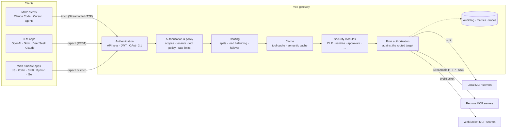

# mcp-gateway

[](https://www.npmjs.com/package/@winstonsayno/mcp-gateway)
[](https://github.com/HarrisonCN/mcp-gateway/actions/workflows/ci.yml)
[](https://github.com/HarrisonCN/mcp-gateway/actions/workflows/codeql.yml)
[](https://securityscorecards.dev/viewer/?uri=github.com/HarrisonCN/mcp-gateway)
[](https://nodejs.org)
[](LICENSE)

**English** · [简体中文](README.zh-CN.md)

**One authenticated, observable endpoint in front of all your MCP servers.**

mcp-gateway sits between AI clients (Claude Code, Cursor, your own agents, LLM apps, web and mobile front-ends) and
the [Model Context Protocol](https://modelcontextprotocol.io) servers they use. Clients connect once — over MCP
Streamable HTTP at `/mcp` or a REST API under `/api/v1` — and the gateway authenticates the caller, checks what it may
do, routes the call to the right upstream and records what happened. Keys, scopes, rate limits, policy, logs and
metrics live in one place instead of in every client.

Current release: **13.1.1** (npm `latest`). Live dashboard demo with simulated traffic, no backend:
<https://harrisoncn.github.io/mcp-gateway/>

## Contents

- [Architecture](#architecture)
- [Key features](#key-features)
- [Quick start](#quick-start)
- [Minimal configuration](#minimal-configuration)
- [Connect clients and LLMs](#connect-clients-and-llms)
- [Security model](#security-model)
- [Observability](#observability)
- [Supported versions](#supported-versions)
- [Documentation](#documentation)
- [Contributing](#contributing)
- [License](#license)

## Architecture



Each call is authenticated, authorized against the caller's scope, routed (a routing split is decided and authorized
**before** any cache lookup), passed through the configured security modules and then authorized once more against the
final target right before it is sent upstream. Feature modules are loaded on demand: a module is only imported when its
section is present in the config.

## Key features

**Core gateway**
- MCP endpoint at `/mcp` (Streamable HTTP, protocol revisions `2025-11-25` back to `2024-11-05`) that aggregates tools,
  resources and prompts from every upstream, with progress, cancellation, logging, completions and subscriptions.
- Upstream transports: `stdio`, `streamable-http`, legacy `sse` and `websocket`, with per-server headers and env.
- REST API under `/api/v1`: tool discovery and calls, resources, prompts, request history, live stats (SSE).
  `GET /api/v1/tools?format=openai|openai-responses|anthropic` returns function-calling schemas for LLM APIs.
- Reconnect with backoff and jitter, MCP `ping` health checks, per-server concurrency limits, timeouts and tool
  allow / deny filters.
- Hot reload of servers, keys, limits and CORS when the config file changes (`start --no-watch` to disable).

**Access control**
- API keys (constant-time compare, `sha256:` digests, expiry / disable), JWT (HMAC, PEM or JWKS; issuer / audience /
  exp checks) and OAuth 2.1 resource server per the MCP authorization spec. Misconfiguration fails closed.
- Per-key scopes (server and tool globs, own rate limit) for keys and JWT claims, enforced on REST and `/mcp`;
  tenants with roles; sliding-window rate limits; brute-force lockout.
- Network guards: IP allowlist, Host / Origin checks against DNS rebinding, body and argument size limits, security
  headers with a hash-based CSP. stdio servers run with an environment allowlist and optional uid / gid, cwd and
  sandbox wrapper ([stdio isolation](docs/security/stdio-isolation.md)).

**Operations**
- Prometheus metrics, OpenTelemetry tracing, optional SQLite audit log, secret redaction in logs, history and API
  output.
- Web dashboard at `/dashboard`: guided setup, live traffic, latency and errors, server health, tool playground,
  request history.
- Liveness / readiness probes, signed container image, Helm chart, Kubernetes operator.
- CLI: `init`, `validate`, `diff` / `apply`, `gen-key` / `hash-key`, `migrate`, `bench`, `conformance`, `desktop`,
  `policy test`, `plugin`, `pq`, `operator`.
- Embeddable as a library: `import { Gateway, loadConfig } from '@winstonsayno/mcp-gateway'`.

**Extended modules** — opt in under `features:`; each has a guide in [`docs/guides`](docs/guides). Among them:
[Cedar / OPA policies](docs/guides/policy-engine.md), [DLP](docs/guides/dlp.md),
[prompt-injection sanitising](docs/guides/sanitize.md), [approval flows](docs/guides/approval-flows.md),
[semantic cache](docs/guides/semantic-cache.md), [rollouts](docs/guides/rollouts.md) and
[blue/green](docs/guides/blue-green.md), [time-travel replay](docs/guides/time-travel.md),
[real-time budgets](docs/guides/realtime-budgets.md), [task graphs](docs/guides/task-graphs.md),
[OpenAI / A2A bridges](docs/guides/bridges.md), [kernel plugin SDK](docs/guides/plugin-sdk.md) and
[multi-region](docs/guides/multi-region.md). These modules are compact and unit-tested but have seen far less
real-world use than the core; test them in your environment before relying on one.

**Experimental** — [confidential computing / TEE attestation](docs/guides/confidential.md),
[post-quantum TLS](docs/guides/pq-tls.md), [edge autonomy](docs/guides/edge-autonomy.md),
[privacy computing](docs/guides/privacy.md) and [post-quantum identity](docs/guides/pq-identity.md). `validate`,
startup and `GET /api/v1/security` print an EXPERIMENTAL notice when one is enabled; each guide lists what it does
**not** do.

## Quick start

Requires Node.js 22 or newer.

### npm / npx

```bash
npx @winstonsayno/mcp-gateway init      # writes mcp-gateway.yml (loopback, two example stdio servers)
npx @winstonsayno/mcp-gateway gen-key   # prints a key for clients and its sha256 digest for the config
# add the digest to mcp-gateway.yml (see Minimal configuration below), then:
npx @winstonsayno/mcp-gateway validate --strict   # schema check; exits 2 on security warnings
npx @winstonsayno/mcp-gateway start
```

Or install it globally: `npm i -g @winstonsayno/mcp-gateway && mcp-gateway start`. The dashboard is at
`http://localhost:4000/dashboard`.

> Without auth the gateway **refuses to start** on a non-loopback address. Configure auth before binding to
> `0.0.0.0`, or — only on a trusted network — pass `start --insecure` (`security.insecure: true`).

### Docker (GHCR)

Multi-arch images (`linux/amd64`, `linux/arm64`) are published as `ghcr.io/harrisoncn/mcp-gateway` with tags
`<version>`, `<major>.<minor>`, `<major>` and `latest`. They run as the unprivileged `node` user and read
`/app/mcp-gateway.yml`.

```bash
docker run -d -p 4000:4000 \
  -v "$PWD/mcp-gateway.yml:/app/mcp-gateway.yml:ro" \
  -v mcp-gateway-data:/app/data \
  -e MCP_GATEWAY_HOST=0.0.0.0 \
  -e MCP_GATEWAY_API_KEYS=sha256:<digest from gen-key> \
  ghcr.io/harrisoncn/mcp-gateway:13
```

`MCP_GATEWAY_API_KEYS` (comma-separated, plain or `sha256:<hex>`) turns on API-key auth without editing the file, and
`MCP_GATEWAY_HOST` overrides the loopback `host` written by `init` so the published port is reachable. stdio servers
run inside the container, which ships Node.js / npm; install anything else (Python, `uvx`, …) in a derived image. A
Compose example with Prometheus is in [`examples/docker`](examples/docker).

Every image is signed with cosign (keyless, GitHub OIDC) and carries SLSA provenance and SBOM attestations. Verify
before you deploy, and pin the digest it prints:

```bash
cosign verify ghcr.io/harrisoncn/mcp-gateway:13.1.1 \
  --certificate-identity-regexp '^https://github.com/HarrisonCN/mcp-gateway/.github/workflows/docker.yml@' \
  --certificate-oidc-issuer https://token.actions.githubusercontent.com
```

More in [supply chain](docs/security/supply-chain.md).

### Kubernetes (Helm)

The chart lives in this repository (it is not published to a chart registry) and requires an API key:

```bash
git clone https://github.com/HarrisonCN/mcp-gateway.git && cd mcp-gateway
kubectl create secret generic gw-secrets --from-literal=MCP_GATEWAY_API_KEYS=sha256:<digest from gen-key>
helm install gw ./deploy/helm/mcp-gateway --set existingSecret=gw-secrets
```

Gateway config goes in the chart's `config:` value. Pods run non-root with a read-only root filesystem; probes use
`/api/v1/health/live` and `/api/v1/health/ready`; HPA, PDB, `ServiceMonitor` and the operator (`McpGateway` CRD) are
off by default. See the [chart README](deploy/helm/mcp-gateway/README.md) and the
[Kubernetes guide](docs/guides/kubernetes.md).

## Minimal configuration

`mcp-gateway.yml` — an authenticated gateway with one stdio server:

```yaml
version: 11            # config schema (13.x uses schema v11)
host: 127.0.0.1        # 0.0.0.0 only together with auth
port: 4000

auth:
  strategy: api-key
  apiKeys:
    - sha256:<digest printed by gen-key>

security:
  dnsRebindingProtection: true   # Host / Origin checks on /mcp and the API
  authLockout: true              # lock out IPs after repeated failed keys

servers:
  - id: filesystem
    name: Filesystem
    transport: stdio
    command: npx
    args: ["-y", "@modelcontextprotocol/server-filesystem", "/tmp"]
```

Every key, environment override, scope and module section is in the
[configuration reference](docs/configuration.md); more complete files are in [`examples/`](examples).

## Connect clients and LLMs

```bash
# REST
curl -H "Authorization: Bearer $KEY" http://localhost:4000/api/v1/tools
curl -X POST http://localhost:4000/api/v1/tools/call \
  -H "Authorization: Bearer $KEY" -H "Content-Type: application/json" \
  -d '{"tool": "read_text_file", "arguments": {"path": "/tmp/hello.txt"}}'

# Claude Code
claude mcp add --transport http gateway http://localhost:4000/mcp --header "Authorization: Bearer $KEY"
```

```jsonc
// Cursor: ~/.cursor/mcp.json
{ "mcpServers": { "gateway": { "url": "http://localhost:4000/mcp", "headers": { "Authorization": "Bearer <key>" } } } }
```

stdio-only clients can bridge with [`mcp-remote`](https://www.npmjs.com/package/mcp-remote):
`npx mcp-remote http://localhost:4000/mcp --header "Authorization: Bearer <key>"`.

**Any LLM with function calling.** The gateway does not call a model itself. `GET /api/v1/tools?format=openai`
(Chat Completions — OpenAI, DeepSeek and other compatible APIs), `format=openai-responses` (Responses API — OpenAI,
xAI Grok) or `format=anthropic` (Claude Messages API) returns the tools the caller may use plus a `mapping` from each
LLM tool name to the gateway `{ server, tool }`; execute the model's tool calls with `POST /api/v1/tools/call`. A
complete loop is in [`examples/llm-tools`](examples/llm-tools); the [OpenAI-compatible bridge](docs/guides/bridges.md)
can also run the loop inside the gateway. These are plain HTTP integrations, not partnerships with model vendors.

**Web pages and apps.** Use REST or the client libraries — [JS / TypeScript](clients/js)
(`@winstonsayno/mcp-gateway-client`), [Kotlin / Android](clients/kotlin), [Swift](clients/swift),
[Python](clients/python), [Go](clients/go). Never ship a long-lived API key in a browser bundle or app binary: put your
backend in the middle, or have it mint short-lived scoped JWTs (`auth.jwt.requireExp`, `maxTokenAgeSeconds`,
`mcp_servers` / `mcp_tools` claims) and restrict origins with `cors.origins` and `mcp.allowedOrigins`.

## Security model

The gateway executes tool calls that can read files, call APIs and spend money: treat it as a privileged service.
**Operators are root-equivalent** (they can change which commands stdio servers run), so give end users scoped keys
or tenant roles.

**Authorization is re-checked after rerouting.** A call can be moved to another server after the first check — by a
`routing` split, `rollouts`, `blue-green`, `self-healing` or a `realtime-budgets` downgrade. Right before the upstream
send, the gateway authorizes the call again against its **final** target (caller scope, tool exposure, tool policy,
data residency and the security guard modules) and then freezes that target. A refused reroute answers `-32003` with
`data.decision: "reroute-denied"`.

**Failed modules have an explicit failure policy.** Every feature module declares one:

| Policy | Modules | While the module is configured but failed |
|---|---|---|
| `closed` | security and enforcement: `dlp`, `sanitize`, `agent-identity`, `policy-engine`, `approval-flows`, `confidential`, `privacy`, `anomaly`, `multimodal`; quota: `console`, `realtime-budgets` | the calls it governs are refused with `-32026` (`data.decision: "module-failed"`); the gateway keeps running |
| `open` | analytics and optimisation, e.g. `genai-otel`, `billing`, `sla`, `semantic-cache`, `rollouts` | its hooks are skipped |
| `degrade` | e.g. `offline`, `self-healing`, `blue-green`, `edge-autonomy` | hooks skipped; results carry `_meta["mcp-gateway/degraded"]` |

Fail-closed is **scoped**: a failed module refuses only the calls in its own configured scope (for example
`dlp.servers`); when that scope cannot be determined it refuses every tool call. Security modules are always `closed`;
`kernel.failurePolicy` may override only `console`, `realtime-budgets` and `billing`.
`GET /api/v1/admin/kernel` shows each module's state and policy.

**Hot reload is staged: Prepare → Validate → Commit.** New connections, catalog and modules are built aside; servers
added by a reload stay hidden (not listed, routed or authorized) until the commit, and removed servers are only
disconnected after a successful commit. An invalid config is rejected and the running one keeps serving.

**Error codes** on `/mcp` (REST answers `403` with the same `code`):

| Code | Meaning |
|---|---|
| `-32003` | forbidden: outside the caller's scope, denied by policy, or `reroute-denied` |
| `-32026` | a `closed` module covering this call has failed (`module-failed`) |

**Secure defaults and checks.** No auth means loopback only; the Helm chart requires an API key; stdio servers do not
inherit `MCP_GATEWAY_*` variables. `mcp-gateway validate --strict` fails on security warnings and
`GET /api/v1/security` reports the running posture. CI runs CodeQL, OpenSSF Scorecard, Trivy, `npm audit` and
property tests; there has been **no independent third-party audit**. Details: [threat model](docs/security/threat-model.md),
[deployment checklist](docs/deployment.md#security-checklist).

**Advisories.** MGW-2026-001 … MGW-2026-006 (reroute re-authorization, fail-closed modules, per-gateway module
failures, transactional reload, split-aware cache keys, staged reload) are fixed in 13.1.1, with backports of the
applicable fixes in 12.0.2 and 10.9.3 — see [SECURITY.md](SECURITY.md#security-advisories). Report vulnerabilities
privately via [GitHub security advisories](https://github.com/HarrisonCN/mcp-gateway/security/advisories/new), not in
public issues.

## Observability

- **Metrics** — `GET /api/v1/metrics` returns JSON aggregates (requests, errors, latency, per-server state). With
  `monitor.prometheus: true`, Prometheus text is served at `/metrics` and `/api/v1/metrics?format=prometheus`. Metric
  names include `mcp_gateway_requests_total`, `mcp_gateway_errors_total`, `mcp_gateway_request_duration_seconds`,
  `mcp_gateway_server_up`, `mcp_gateway_authz_denials_total`, `mcp_gateway_reroute_denials_total`,
  `mcp_gateway_module_failure_denials_total` and `mcp_gateway_degraded_calls_total`. Metrics are public by default;
  require auth with `auth.protect.metrics`.
- **Audit log** — `audit.enabled: true` keeps request metadata (never arguments or results) in SQLite via the built-in
  `node:sqlite`; `GET /api/v1/requests` queries it with filters and paging, and `audit.export` forwards records to a
  SIEM. Refused reroutes and calls refused by a failed module are recorded too.
- **Tracing** — OpenTelemetry spans per upstream call, exported over OTLP/HTTP without an SDK
  (`observability.tracing`), with W3C `traceparent` propagation.
- **Health** — `/api/v1/health/live`, `/api/v1/health/ready`, `/api/v1/health`; live stats at `/api/v1/stats` and the
  SSE stream `/api/v1/events`, which feed the dashboard.

See [Observability](docs/configuration.md#observability) and [Audit log](docs/configuration.md#audit-log).

## Supported versions

| Line | Latest | npm dist-tag | Image tag | Status |
|---|---|---|---|---|
| 13.x | 13.1.1 | `latest` | `:13`, `:latest` | Current — new features, bug and security fixes |
| 12.x | 12.0.2 | `v12-0` | `:12` | Superseded — carries the MGW-2026-001 and MGW-2026-005 fixes; upgrade to 13.x |
| 11.x | 11.2.0 | — | `:11` | Superseded — upgrade to 13.x |
| 10.x (LTS) | 10.9.3 | `v10-lts` | `:10` | Bug and security fixes until 2027-10-31, then security fixes only until 2028-10-31 |
| < 10.0 | — | — | — | Unsupported — upgrade with `mcp-gateway migrate` |

```bash
npm i @winstonsayno/mcp-gateway            # 13.x
npm i @winstonsayno/mcp-gateway@v10-lts    # 10.x LTS
```

Upgrading: from 10.x run `npx @winstonsayno/mcp-gateway@13 migrate --write` (config schema v10 → v11, see
[Migrating to 11.0](docs/guides/migrating-to-v11.md)); from 11.x / 12.x no config migration is needed — read
[Migrating to 12.0](docs/guides/migrating-to-v12.md) and [Migrating to 13.0](docs/guides/migrating-to-v13.md).

The project follows [Semantic Versioning](https://semver.org/). Within a major line the `/api/v1` REST API, `/mcp`
behaviour, the config schema, CLI commands and flags, root library exports and Prometheus metric names change only in
backward-compatible ways — see [stability and versioning](docs/api-reference.md#stability-and-versioning).

## Documentation

| | |
|---|---|
| [Getting started](docs/guides/getting-started.md) | First gateway, step by step |
| [Configuration](docs/configuration.md) | Every config key, env overrides, scopes, hot reload |
| [API reference](docs/api-reference.md) | REST `/api/v1`, admin API, `/mcp`, error codes |
| [Deployment](docs/deployment.md) | Docker, Kubernetes, reverse proxy, systemd, security checklist |
| [Guides](docs/guides) | One page per module, plus migration guides |
| [Security](SECURITY.md) · [Threat model](docs/security/threat-model.md) | Advisories, hardening, trust boundaries |
| [Changelog](CHANGELOG.md) | Every release |
| [Dashboard](dashboard/README.md) | The built-in web UI |

## Contributing

```bash
git clone https://github.com/HarrisonCN/mcp-gateway.git && cd mcp-gateway
npm ci
npm run typecheck && npm test
npm run dev -- start -c examples/basic/mcp-gateway.yml
```

See [CONTRIBUTING.md](docs/CONTRIBUTING.md). When a change is user-facing, update both READMEs (English and
简体中文).

## License

[MIT](LICENSE) © 2026 HarrisonCN
