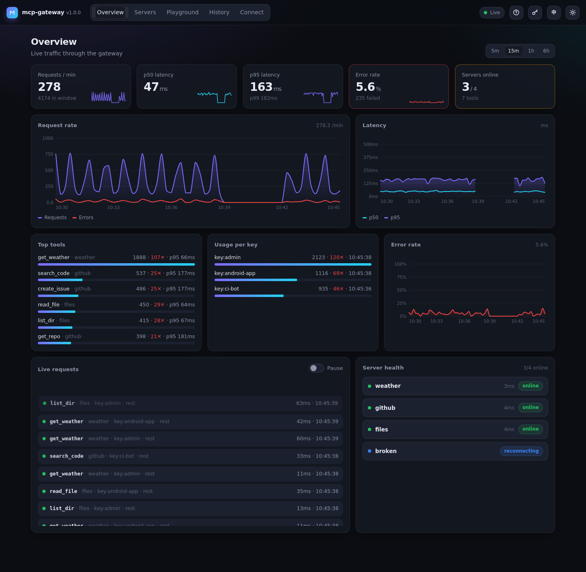

<div align="center">


# mcp-gateway

**A lightweight, open-source gateway for your MCP servers.**

Route · Authenticate · Rate-limit · Monitor — all your [Model Context Protocol](https://modelcontextprotocol.io) servers from a single endpoint.

[](LICENSE)
[](https://nodejs.org)
[](https://www.typescriptlang.org)
[](https://www.npmjs.com/package/@winstonsayno/mcp-gateway)
[](https://github.com/HarrisonCN/mcp-gateway/actions/workflows/ci.yml)
[](https://github.com/HarrisonCN/mcp-gateway/pkgs/container/mcp-gateway)

[English](#) · [中文](docs/README.zh-CN.md) · [API reference](docs/api-reference.md) · [Configuration](docs/configuration.md) · [Deployment](docs/deployment.md) · [Examples](examples/)

</div>

---

> **Live demo:** try the dashboard with simulated traffic — <https://harrisoncn.github.io/mcp-gateway/> (runs entirely in your browser).

## The Problem

As [MCP](https://modelcontextprotocol.io) becomes the standard protocol for AI agents to interact with tools, teams are running **dozens of MCP servers** — filesystem, GitHub, databases, Slack, search, and more. Managing them is chaos:

- Every AI client connects to every server independently
- No central authentication or access control
- No visibility into which tools are being called, by whom, and how often
- No rate limiting to prevent runaway agents from hammering your APIs

**mcp-gateway solves this.** It sits between your AI clients and your MCP servers, acting as a single, observable, secure entry point.

```
┌─────────────────────────────────────────────────────────┐
│                      AI Clients                         │
│   Claude Code · Cursor · Copilot · Your App · Scripts   │
└─────────────────────┬───────────────────────────────────┘
                      │  HTTP / REST
                      ▼
┌─────────────────────────────────────────────────────────┐
│                   mcp-gateway                           │
│                                                         │
│  ┌──────────┐  ┌──────────┐  ┌──────────────────────┐  │
│  │   Auth   │  │  Router  │  │  Metrics / Monitor   │  │
│  │ API Key  │  │ Tool →   │  │  Prometheus · Logs   │  │
│  │   JWT    │  │ Server   │  │  Dashboard           │  │
│  └──────────┘  └──────────┘  └──────────────────────┘  │
│                                                         │
│  ┌──────────┐  ┌──────────┐  ┌──────────┐              │
│  │Rate Limit│  │ Registry │  │  Health  │              │
│  └──────────┘  └──────────┘  └──────────┘              │
└──────┬──────────────┬──────────────┬────────────────────┘
       │              │              │  stdio / SSE / WS
       ▼              ▼              ▼
┌──────────┐  ┌──────────┐  ┌──────────┐
│Filesystem│  │  GitHub  │  │PostgreSQL│  ... more
│  Server  │  │  Server  │  │  Server  │
└──────────┘  └──────────┘  └──────────┘
```

## Features

- **Unified API endpoint** — one URL for all your MCP tools, auto-routed by tool name
- **MCP endpoint for clients** — `/mcp` speaks MCP Streamable HTTP (2025-06-18 / 2025-03-26), so Claude Code, Cursor or any MCP client sees every upstream tool through one server, with the same auth, limits and metrics — including progress notifications, cancellation, logging, completions and resource subscriptions
- **Every MCP transport** — `stdio`, `streamable-http` (current spec), legacy `sse` (HTTP+SSE) and `websocket` upstream servers, with per-server headers for upstream auth
- **Automatic reconnect** — crashed or disconnected servers are reconnected with exponential backoff + jitter; state is visible in `/servers`, `/health`, the dashboard and Prometheus
- **Authentication** — API keys (constant-time compare, storable as `sha256:` digests, with expiry), JWT (HMAC secret, PEM public key or JWKS URL; issuer / audience / exp checks), or no-auth; misconfiguration fails closed
- **Hardening** — security headers + hash-based CSP, IP allowlist, Host / Origin checks against DNS rebinding, body and argument size limits, brute-force lockout, secret redaction in logs and history, startup security warnings (`mcp-gateway validate --strict`)
- **Rate limiting** — per-key sliding-window counter, with standard `X-RateLimit-*` headers
- **Per-key scopes** — restrict an API key (or a JWT via claims) to some servers / tools and give it its own rate limit; enforced on REST and `/mcp`
- **Concurrency limits** — per-server `maxConcurrency`, queued requests count against `timeout`
- **Health monitoring** — periodic MCP `ping` health checks with latency (every 30 s, configurable)
- **Metrics** — Prometheus-compatible `/metrics` endpoint (monotonic counters) + JSON aggregation
- **Config hot reload** — servers, API keys / auth, rate limits, CORS and reconnect policy apply without a restart (disable with `--no-watch`)
- **Optional auth for health & metrics** — keep `/health` and `/metrics` public (default) or put them behind auth; the dashboard asks for a key
- **Tool discovery** — `GET /api/v1/tools` lists all tools across all servers
- **Resources & prompts** — `resources/*` and `prompts/*` from every server, aggregated on REST and `/mcp`
- **Persistent audit log** — optional SQLite history (built-in `node:sqlite`, no dependency) queryable via `GET /api/v1/requests` and the dashboard
- **Tool filtering** — per-server `tools.allow` / `tools.deny` glob patterns hide tools you don't want exposed (and block calls to them)
- **YAML/JSON config** — simple, declarative configuration with env var overrides
- **Docker-ready** — official Docker image, Compose examples included
- **TypeScript SDK** — embed the gateway as a library in your own project
- **Client libraries** — a dependency-free TypeScript client ([`clients/js`](clients/js), browser + Node) and a Kotlin/JVM/Android client ([`clients/kotlin`](clients/kotlin))
- **LLM tool schemas** — `GET /api/v1/tools?format=openai|anthropic` returns ready-to-use function-calling definitions

## Quick Start

### Install

```bash
npm install -g @winstonsayno/mcp-gateway
# or
npx @winstonsayno/mcp-gateway init
```

### Configure

```bash
# Generate a default config file
mcp-gateway init

# Edit mcp-gateway.yml to add your servers
```

```yaml
# mcp-gateway.yml
port: 4000

servers:
  - id: filesystem
    name: Filesystem
    transport: stdio
    command: npx
    args: ["-y", "@modelcontextprotocol/server-filesystem", "/tmp"]

  - id: github
    name: GitHub
    transport: stdio
    command: npx
    args: ["-y", "@modelcontextprotocol/server-github"]
    env:
      GITHUB_PERSONAL_ACCESS_TOKEN: "${GITHUB_TOKEN}"
```

### Run

```bash
mcp-gateway start
# → mcp-gateway listening on http://0.0.0.0:4000
# → ✓ Filesystem — 8 tools available
# → ✓ GitHub — 26 tools available
```

### Call a Tool

```bash
# List all available tools
curl http://localhost:4000/api/v1/tools

# Call a tool (auto-routes to the right server)
curl -X POST http://localhost:4000/api/v1/tools/call \
  -H "Content-Type: application/json" \
  -d '{"tool": "read_file", "arguments": {"path": "/tmp/hello.txt"}}'

# With authentication
curl -X POST http://localhost:4000/api/v1/tools/call \
  -H "Authorization: Bearer your-api-key" \
  -H "Content-Type: application/json" \
  -d '{"tool": "create_issue", "server": "github", "arguments": {"title": "Bug report", "body": "..."}}'
```

## Use the gateway as an MCP server (`/mcp`)

The gateway is itself an MCP server: `http://<host>:4000/mcp` implements the
[Streamable HTTP transport](https://modelcontextprotocol.io/specification/2025-06-18/basic/transports)
(protocol `2025-06-18`, `2025-03-26` accepted). Clients get one aggregated, filtered tool list; calls are
routed to the right upstream server with the gateway's auth, rate limit, `maxConcurrency`, timeouts,
metrics and request log.

**Claude Code**

```bash
claude mcp add --transport http gateway http://localhost:4000/mcp \
  --header "Authorization: Bearer your-secret-key"
```

**Cursor** (`~/.cursor/mcp.json` or `.cursor/mcp.json`)

```json
{
  "mcpServers": {
    "gateway": {
      "url": "http://localhost:4000/mcp",
      "headers": { "Authorization": "Bearer your-secret-key" }
    }
  }
}
```

**Clients that only speak stdio** (e.g. older Claude Desktop builds) can bridge with
[`mcp-remote`](https://www.npmjs.com/package/mcp-remote):
`npx mcp-remote http://localhost:4000/mcp --header "Authorization: Bearer your-secret-key"`.

**Any SDK client**

```ts
import { Client } from '@modelcontextprotocol/sdk/client/index.js';
import { StreamableHTTPClientTransport } from '@modelcontextprotocol/sdk/client/streamableHttp.js';

const client = new Client({ name: 'my-app', version: '1.0.0' });
await client.connect(new StreamableHTTPClientTransport(new URL('http://localhost:4000/mcp'), {
  requestInit: { headers: { Authorization: 'Bearer your-secret-key' } },
}));
const { tools } = await client.listTools();
```

What the endpoint does:

| | |
|---|---|
| `POST /mcp` | JSON-RPC: `initialize`, `ping`, `tools/list` (paginated), `tools/call`, `resources/list`, `resources/templates/list`, `resources/read`, `resources/subscribe` / `unsubscribe`, `prompts/list`, `prompts/get`, `logging/setLevel`, `completion/complete`, notifications (incl. `notifications/cancelled`). Batches are accepted. Responses are `application/json`; a single `tools/call` with `_meta.progressToken` switches to an SSE reply when the upstream reports progress (`notifications/progress`, then the result). |
| `GET /mcp` | SSE stream for server→client notifications: `notifications/tools/list_changed`, `notifications/resources/list_changed` and `notifications/prompts/list_changed` are sent when the aggregated list a session sees changes (a server announces changes, connects, is removed by hot reload, …); `notifications/resources/updated` for subscribed URIs; upstream `notifications/message` at or above the session's `logging/setLevel` level (`logger` = `<serverId>/<logger>`). |
| Resources & prompts | Resource URIs are passed through unchanged; when two servers list the same URI the lowest server id wins. `resources/read` is routed by exact URI, then by resource template, then to the only server with resources. Prompt names follow `toolNaming` like tools. `resources/subscribe` is routed the same way; sessions share one upstream subscription per URI, restored after reconnects. `completion/complete` is routed by prompt name or resource template. |
| `DELETE /mcp` | Ends the session. |
| Sessions | `initialize` returns `Mcp-Session-Id`; later requests must send it (`400` if missing, `404` if unknown or expired). A session is bound to the API key / JWT subject that created it. Idle sessions expire after `mcp.sessionIdleTimeoutSeconds`. |
| Tool names | `toolNaming: auto` (default) keeps a tool's name unless two servers expose the same name; then every copy becomes `<serverId>__<tool>`. `prefix` always uses `<serverId>__<tool>`. Ordering is deterministic (server id, then tool name). In `auto` mode the prefixed form is also accepted by `tools/call`. |
| Errors | Unknown tool / bad params → JSON-RPC `-32602`; rate limit → `-32029` with `data.retryAfter`; server offline or timed out → a normal result with `isError: true` (so the model sees it); upstream JSON-RPC errors are forwarded unchanged; cancelled → `-32800`. |
| Cancellation | `notifications/cancelled` (or the client dropping the HTTP request) cancels the upstream call, which receives its own `notifications/cancelled`. |
| Security | Same `auth` as the REST API (`Authorization: Bearer …` or `X-API-Key`). Requests with an `Origin` header are rejected (`403`) unless it matches `mcp.allowedOrigins` (default: `cors.origins`) — set this when the gateway listens on a reachable address. |

## API Reference

| Method | Path | Description |
|--------|------|-------------|
| `GET` | `/api/v1/health` | Gateway health and server summary |
| `GET` | `/api/v1/servers` | List all registered servers |
| `GET` | `/api/v1/servers/:id` | Get server details and tools |
| `GET` | `/api/v1/tools` | List all tools (filterable by `?server=` or `?tag=`; `?format=openai\|openai-responses\|anthropic` for LLM schemas) |
| `POST` | `/api/v1/tools/call` | Invoke a tool |
| `POST` | `/api/v1/servers/:id/reconnect` | Reconnect a server now (resets backoff) |
| `GET` | `/api/v1/health/live` | Liveness probe — always public, returns only `{"status":"ok"}` |
| `GET` | `/api/v1/health/ready` | Readiness probe — always public; `200` when servers are ready, else `503` (`?min=N`) |
| `GET` | `/api/v1/metrics` | Aggregated metrics (JSON or Prometheus) |
| `GET` | `/api/v1/resources` | Resources of all servers (`?server=`), duplicate URIs collapsed |
| `GET` | `/api/v1/resources/templates` | Resource templates (`?server=`) |
| `POST` | `/api/v1/resources/read` | Read a resource: `{"uri": "...", "server"?: "..."}` |
| `GET` | `/api/v1/prompts` | Prompts of all servers (`?server=`) |
| `POST` | `/api/v1/prompts/get` | Get a prompt: `{"name": "...", "server"?: "...", "arguments"?: {...}}` |
| `GET` | `/api/v1/requests` | Request history, newest first (`?limit=` max 500, `server`, `tool`, `client`, `success`, `via`, `kind`, `since`, `until`, `cursor`) |
| `GET` | `/api/v1/stats` | Live dashboard data: time series (count, errors, p50/p95 per bucket), summary, top tools, per-server and per-key usage (`?window=`, `?bucket=` ms) |
| `GET` | `/api/v1/events` | Server-Sent Events: a `request` event per call, a `snapshot` (health + summary) every 2 s |
| `POST` `GET` `DELETE` | `/mcp` | MCP Streamable HTTP endpoint (see [above](#use-the-gateway-as-an-mcp-server-mcp)) |

`/health` and `/metrics` are unauthenticated by default; set `auth.protect.health` / `auth.protect.metrics`
to require auth for them too (`/health/live` and `/health/ready` always stay public for Docker / Kubernetes probes).
Every other route requires auth when it is enabled.
`/metrics` returns JSON by default (`?window=<ms>`); with `monitor.prometheus: true` it returns the
Prometheus text format when the client asks for `text/plain` (as Prometheus does) or passes `?format=prometheus`.

### LLM tool schemas

`GET /api/v1/tools?format=openai` (Chat Completions), `openai-responses` (Responses API) or `anthropic` (Messages API)
returns the tools the caller may use as function-calling definitions, plus a `mapping` from each LLM tool
name back to the gateway server and tool:

```json
{
  "format": "anthropic",
  "tools": [{ "name": "github__create_issue", "description": "…", "input_schema": { "type": "object", "properties": { … } } }],
  "mapping": { "github__create_issue": { "server": "github", "tool": "create_issue" } },
  "total": 1
}
```

Pass `tools` straight to the provider; when the model calls a tool, look it up in `mapping` and
`POST /api/v1/tools/call` with that `server` / `tool` (the clients' `callLlmTool()` does this).
Names follow `mcp.toolNaming`, are sanitised to `^[a-zA-Z0-9_-]{1,64}$` and de-duplicated; `$schema` is stripped and
`parameters` is always an object schema. Scopes and `?server=` / `?tag=` filters apply.

### Client libraries

| | |
|---|---|
| **TypeScript / JavaScript** — [`clients/js`](clients/js) | `@winstonsayno/mcp-gateway-client`: zero dependencies, `fetch`-based (browser, Node 18+, Deno, Bun, React Native), typed `health`, `servers`, `listTools`, `toolSchemas`, `callTool`, `callLlmTool`, plus a small MCP-over-`/mcp` session helper |
| **Kotlin / JVM / Android** — [`clients/kotlin`](clients/kotlin) | OkHttp + kotlinx.serialization, Java 11 bytecode; same API surface, `McpSession` for `/mcp` |

Both are in this repository and not yet published to npm / Maven Central.

`POST /api/v1/tools/call` responses:

| Status | Meaning |
|--------|---------|
| `200` | Tool returned a result |
| `400` | Invalid body (`tool` must be a string, `arguments` an object) or malformed JSON |
| `403` | The tool is hidden by the server's `tools` filter (also when `"server"` is passed explicitly), or outside the caller's scope |
| `404` | Unknown tool or server |
| `409` | Tool name is exposed by several servers — pass `"server"` to choose |
| `429` | Rate limited (see `Retry-After`) |
| `502` | The MCP server returned an error |
| `503` | Server is not connected (body has `status`, e.g. `reconnecting`; `Retry-After` when a retry is scheduled) |
| `504` | The MCP server did not answer within `timeout` |

## Configuration Reference

```yaml
port: 4000                    # HTTP port (env: MCP_GATEWAY_PORT)
host: 0.0.0.0                 # Bind address (env: MCP_GATEWAY_HOST)
logLevel: info                # debug | info | warn | error

auth:
  strategy: api-key           # none | api-key | jwt | oauth2 (OAuth 2.1 resource server, see docs/configuration.md)
  apiKeys:
    - "your-secret-key"       # full access
    - "sha256:…"              # a key stored as its digest (mcp-gateway gen-key / hash-key)
    - key: "${APP_KEY}"       # scoped key (see "Per-key scopes")
      name: app
      servers: ["github"]
      tools: ["read_*"]
      rateLimit: { limit: 30, windowSeconds: 60 }
      expiresAt: "2027-01-01" # optional expiry; disabled: true switches a key off
  protect:
    health: false             # true → /api/v1/health requires auth
    metrics: false            # true → /api/v1/metrics requires auth (configure your scraper)

reconnect:                    # automatic reconnect of crashed / disconnected servers
  enabled: true
  initialDelayMs: 1000        # first retry delay
  maxDelayMs: 60000           # backoff cap
  multiplier: 2               # delay *= multiplier after each failure
  jitter: 0.2                 # ±20 % randomisation
  maxAttempts: 0              # 0 = retry forever; else give up (status: offline)

health:
  intervalMs: 30000           # MCP ping interval
dashboard:
  enabled: true               # serve /dashboard

rateLimit:
  limit: 100                  # Max requests per window
  windowSeconds: 60           # Window duration
  perKey: true                # Per-key or global

monitor:
  requestLog: true            # Log all requests
  prometheus: true            # Enable Prometheus /metrics
  retentionHours: 24          # Metrics retention

security:                     # hardening (see docs/configuration.md#security)
  authLockout: true           # 429 for IPs with repeated auth failures
  dnsRebindingProtection: false  # true for a local gateway without auth
  ipAllowlist: ["10.0.0.0/8"]
  maxToolArgumentsBytes: 262144

cors:
  origins:
    - "https://your-app.com"

audit:                        # persistent request history (SQLite, Node 22.5+; default off)
  enabled: false
  path: mcp-gateway-audit.db
  retentionDays: 30           # 0 = keep forever

mcp:                          # downstream MCP endpoint (Streamable HTTP)
  enabled: true               # restart required to change
  path: /mcp                  # restart required to change; not "/" or under /api, /dashboard
  toolNaming: auto            # auto | prefix  ("<serverId>__<tool>")
  pageSize: 500               # tools per tools/list page
  sessionIdleTimeoutSeconds: 1800
  maxSessions: 1000           # least recently used idle session is evicted beyond this
  # allowedOrigins: ["https://your-app.com"]   # browser origins allowed on /mcp (default: cors.origins)
  # instructions: "Tools for the ACME workspace"  # returned from initialize

servers:
  - id: my-server             # Unique identifier
    name: My Server           # Display name
    transport: stdio          # stdio | streamable-http | sse | websocket
    command: npx
    args: ["-y", "@modelcontextprotocol/server-filesystem", "/tmp"]
    env:
      MY_VAR: "${ENV_VAR}"    # Environment variable substitution
    tags: [files, local]
    enabled: true
    timeout: 30000            # ms, includes time queued behind maxConcurrency
    maxConcurrency: 10        # max in-flight tool calls for this server
    tools:                    # optional: expose only some tools (globs: * and ?, deny wins)
      allow: ["read_*", "list_*"]
      deny: ["*_secret"]
    reconnect:                # optional per-server override of the reconnect block
      maxAttempts: 5

  - id: remote
    name: Remote server
    transport: streamable-http   # MCP 2025-03-26+ (POST + optional SSE responses, Mcp-Session-Id)
    url: https://mcp.example.com/mcp
    headers:
      Authorization: "Bearer ${REMOTE_MCP_TOKEN}"   # ${VAR} expanded from the gateway's env

  - id: legacy
    name: Legacy SSE server
    transport: sse            # MCP 2024-11-05 HTTP+SSE (GET stream + POST to the announced endpoint)
    url: http://localhost:8080/sse

  - id: socket
    name: WebSocket server
    transport: websocket      # one JSON-RPC message per frame, "mcp" subprotocol
    url: ws://localhost:8081
    subprotocol: mcp          # "" to request no subprotocol
```

### Hot reload

With `mcp-gateway start` the config file is watched (disable with `--no-watch`). On save:

| Applied immediately | Needs a restart |
|---------------------|-----------------|
| `servers` (added / changed / removed / disabled) | `port`, `host` |
| `auth` (strategy, keys, JWT secret, `protect`) | `monitor.retentionHours` |
| `rateLimit` (counters reset when it changes) | `health.intervalMs` |
| `cors.origins`, `monitor.requestLog`, `monitor.prometheus` | `dashboard` |
| `reconnect`, `logLevel` | `mcp.enabled`, `mcp.path`, `audit` |
| `mcp.toolNaming`, `mcp.pageSize`, session limits, `mcp.allowedOrigins` | |

An invalid file is rejected and the running config is kept. `MCP_GATEWAY_*` env overrides keep precedence.

### Per-key scopes

Give each app its own key and only the tools it needs. Plain string keys keep full access;
object entries can be restricted (all fields except `key` are optional):

```yaml
auth:
  strategy: api-key
  apiKeys:
    - "admin-key"                       # unrestricted
    - key: ${AURA_GATEWAY_KEY}          # ${VAR} is expanded in object keys
      name: aura                        # client id "key:aura" in logs, metrics and sessions (unique)
      servers: ["github", "fs-*"]       # server id globs
      tools: ["read_*", "github/create_issue"]   # tool globs; "server/tool" when the pattern has a "/"
      rateLimit: { limit: 30, windowSeconds: 60 } # own bucket instead of the global rateLimit
```

- A tool must pass the server's own `tools` filter **and** the key's `servers` **and** `tools` lists.
  An absent list means no restriction; an empty list allows nothing.
- **Discovery hides** what a key may not use: `GET /tools`, `GET /servers`, `GET /servers/:id` (→ `404`), `/mcp` `tools/list`.
- **Calls are refused**: `POST /tools/call` and `POST /servers/:id/reconnect` → `403`; `/mcp` `tools/call` → JSON-RPC error `-32003`.
  Auto-routing only considers servers the key may use, so a name that collides elsewhere can still be called without `"server"`.
- On `/mcp`, collision prefixes are computed from what the key can see (a key scoped to one server sees bare names).
- Restricted keys only see their own entries in `GET /requests`.
- **JWT**: put globs in the `mcp_servers` / `mcp_tools` claims (array, or a space/comma-separated string), e.g.
  `{"sub": "user-1", "mcp_servers": ["github"], "mcp_tools": "read_* github/create_issue"}`. A malformed claim allows nothing.
- Hot reloadable: changing scopes applies to the next request; open `/mcp` sessions get `notifications/tools/list_changed`,
  and sessions of removed keys are closed.

### Resources & prompts

Servers that announce the `resources` / `prompts` capabilities have their resources, resource templates and
prompts listed at connect time (and refreshed on `notifications/*/list_changed`). They are available on REST
(`/api/v1/resources`, `/resources/templates`, `/resources/read`, `/prompts`, `/prompts/get`) and on `/mcp`.
Reads and gets are forwarded live with the server's `timeout`, counted against the rate limit and recorded in
metrics / history with `kind: "resource"` or `"prompt"`. Key scopes apply by **server** (`servers` globs);
`tools` globs and `servers[].tools` filters only concern tools.

```bash
curl -s localhost:4000/api/v1/resources
curl -s -X POST localhost:4000/api/v1/resources/read -H 'content-type: application/json' -d '{"uri":"file:///notes/todo.md"}'
curl -s -X POST localhost:4000/api/v1/prompts/get -H 'content-type: application/json' \
  -d '{"name":"review-code","server":"github","arguments":{"pr":"42"}}'
```

### Persistent audit log

By default request history lives in memory (`monitor.retentionHours`). Enable the audit log to keep it in SQLite
across restarts:

```yaml
audit:
  enabled: true
  path: ./data/mcp-gateway-audit.db   # default mcp-gateway-audit.db (WAL mode)
  retentionDays: 30                   # pruned hourly; 0 = keep forever
```

- Uses Node's built-in [`node:sqlite`](https://nodejs.org/api/sqlite.html) (**Node 22.5+**): no extra dependency and
  nothing native to compile. Node 22.0–22.4 refuses to start with `audit.enabled: true` and says why. Node may
  print an `ExperimentalWarning` for `node:sqlite`.
- Only metadata is stored: time, server, tool / URI / prompt, kind, duration, success, error message, client id, `via`
  (`rest` / `mcp`). Arguments and results are never stored.
- `GET /api/v1/requests` then reads from the database (`"source": "audit"`) and supports filters
  (`server`, `tool`, `client`, `success=true|false`, `via=rest|mcp`, `kind=tool|resource|prompt`, `since` / `until` as ISO
  or epoch ms) and paging (`nextCursor` → `?cursor=`). Restricted keys only ever see their own records.
  The dashboard's *Request History* panel has the same filters and a *Load older* button.
- Library users can plug in any store: `metrics.setAuditStore(myStore)` with the `AuditStore` interface.
- Changing `audit` requires a restart.

### Tool filtering

Expose only part of a server's tools — e.g. make a filesystem server read-only, or drop tools that
clash with another server's names:

```yaml
servers:
  - id: filesystem
    name: Filesystem (read-only)
    transport: stdio
    command: npx
    args: ["-y", "@modelcontextprotocol/server-filesystem", "/data"]
    tools:
      allow: ["read_*", "list_*", "search_files", "get_file_info"]
      deny: ["*_media_file"]
```

- Patterns are globs matched against the whole tool name, case-sensitive: `*` = any characters, `?` = one character.
- A tool is exposed when it matches an `allow` pattern (or `allow` is absent / empty) **and** no `deny` pattern. Deny wins.
- Hidden tools are absent from `GET /tools`, `GET /servers/:id`, tool counts and metrics, and don't cause
  name conflicts with other servers. Calling one returns `404` (auto-routing) or `403` (explicit `"server"`).
- The filter is applied to every tool list, including updates via `notifications/tools/list_changed`.
  Changing it in the config file is applied by hot reload (the server is reconnected).

### Reconnect & server status

Each server's `health.status` is one of `online`, `degraded` (connected, but the health ping failed),
`reconnecting` (lost — a retry is scheduled or running), `offline` (gave up, or reconnect disabled) or `unknown`.
`GET /api/v1/servers/:id` also returns `health.reconnect` (`state`, `attempt`, `nextAttemptAt`, `lastError`,
`reconnects`) and `session` (`transport`, negotiated `protocolVersion`, `serverInfo`, `connectedAt`).

Prometheus series added: `mcp_gateway_server_up`, `mcp_gateway_server_status{status=…}`,
`mcp_gateway_server_reconnects_total`, `mcp_gateway_server_reconnect_attempt`, `mcp_gateway_server_ping_ms`.

## Docker

```bash
# Pull and run
docker run -p 4000:4000 \
  -v $(pwd)/mcp-gateway.yml:/app/mcp-gateway.yml \
  -e GITHUB_TOKEN=ghp_... \
  ghcr.io/harrisoncn/mcp-gateway:latest

# Or with Docker Compose (gateway + Prometheus; see examples/docker)
cd examples/docker
GATEWAY_API_KEY=change-me docker compose up
```

The image's `HEALTHCHECK` uses the always-public `/api/v1/health/live`, so it keeps working when
`auth.protect.health` is on.

### Liveness vs. readiness (Kubernetes, load balancers)

| Probe | Answers | Use it for |
|-------|---------|------------|
| `GET /api/v1/health/live` | always `200 {"status":"ok"}` while the process serves HTTP | restart a hung container |
| `GET /api/v1/health/ready` | `200` when the upstream servers are ready, otherwise `503` | only route traffic to gateways that can serve tool calls |

A server counts as ready when it is enabled, connected and not `degraded` (failing health pings).
By default **every** enabled server must be ready; `?min=N` requires at least `N` instead (useful when
some servers are optional). With no servers configured the gateway is ready. While shutting down it
answers `503 {"status":"shutting_down"}` so load balancers drain it first. The body only carries counts:

```json
{ "status": "not_ready", "servers": { "ready": 1, "total": 2, "required": 2 } }
```

```yaml
# Kubernetes
livenessProbe:
  httpGet: { path: /api/v1/health/live, port: 4000 }
readinessProbe:
  httpGet: { path: /api/v1/health/ready, port: 4000 }   # or /api/v1/health/ready?min=1
  periodSeconds: 10
```

## Dashboard

Open `http://localhost:4000/dashboard`. The first visit opens a short guided setup: connect with an API key,
see the upstream servers, call a tool from a form generated from its JSON schema, and copy a ready-made
config for Claude Desktop, Cursor, Claude Code, the JS / Kotlin clients or curl. Reopen it any time with the
**?** button. After that the dashboard shows live request rate, p50 / p95 latency, error rate, top tools,
usage per key, a live request stream, server health (with reconnect) and the filterable request history.
It is one static file with no build step and no CDN; English / 中文, dark / light, and it works on phones.



When auth is enabled the key is kept in the browser tab (`sessionStorage`, or `localStorage` with
“remember”) and sent as `Authorization: Bearer …` on every API call. The page itself contains no data; set
`dashboard.enabled: false` to stop serving it. See [dashboard/README.md](dashboard/README.md).

## Embed as a Library

```typescript
import { Gateway, loadConfig } from '@winstonsayno/mcp-gateway';

const config = await loadConfig('./mcp-gateway.yml');
const gateway = new Gateway(config);

await gateway.start();
// Gateway is now running at http://localhost:4000

// Graceful shutdown
process.on('SIGTERM', () => gateway.stop());
```

## What's New in v3.3

| Feature | Description |
|---------|-------------|
| **WASM plugins** | `wasm: ./plugin.wasm` — write plugins in any language that compiles to WebAssembly |
| **Tenant isolation** | One sandbox per tenant / client; no WASI, no host access; time and memory limits |
| **API** | `GET /api/v1/plugins` lists plugins and live sandboxes |

Details: [CHANGELOG](CHANGELOG.md) · [Plugins guide](docs/guides/plugins.md#wasm-plugins-33).

## What's New in v3.2

| Feature | Description |
|---------|-------------|
| **Request debugger** | Click a History row: arguments, result, metadata |
| **Replay** | Re-run a call with the same or edited arguments; structural diff of the results |
| **API** | `GET /api/v1/requests/:id`, `POST /api/v1/requests/:id/replay` (`replay.enabled`) |

Details: [CHANGELOG](CHANGELOG.md).

## What's New in v3.1

| Feature | Description |
|---------|-------------|
| **Sampling passthrough** | Upstream `sampling/createMessage` reaches the calling MCP client's LLM |
| **Elicitation passthrough** | `elicitation/create` asks the calling client's user |
| **Roots passthrough** | `roots/list` + `roots/list_changed` between clients and servers |

Config: [`mcp.passthrough`](docs/configuration.md#mcp-endpoint). Details: [CHANGELOG](CHANGELOG.md).

## What's New in v3.0

**Breaking:** config schema v3 (`cors.origins`, `health.intervalMs`), plugin API v2 — see the
[migration guide](docs/guides/migrating-to-v3.md) and the [roadmap](docs/ROADMAP.md).

| Feature | Description |
|---------|-------------|
| **Config schema v3** | `corsOrigins` / `healthCheckIntervalMs` removed; `version: 3` |
| **Plugin API v2** | Hook context argument, new `onError` hook; v1 deprecated |
| **Docs** | Refreshed for v3, [migrating to 3.0](docs/guides/migrating-to-v3.md), [roadmap 3.1 – 4.0](docs/ROADMAP.md) |

Details: [CHANGELOG](CHANGELOG.md).

## What's New in v2.9

| Feature | Description |
|---------|-------------|
| **Admin API** | Read, validate, diff and hot-apply the config over REST (`/api/v1/admin`) |
| **Declarative config** | `mcp-gateway diff` / `apply` — [guide](docs/guides/declarative-config.md) |
| **3.0 deprecations** | `corsOrigins` → `cors.origins`, `healthCheckIntervalMs` → `health.intervalMs` (warnings in 2.9, removed in 3.0) |

Details: [CHANGELOG](CHANGELOG.md).

## What's New in v2.8

| Feature | Description |
|---------|-------------|
| **Policy as code** | `policy.files` + policy unit tests, `mcp-gateway policy test` for CI |
| **SIEM export** | Audit records to syslog (UDP / TCP / TLS) or webhooks — [guide](docs/guides/policy-as-code.md) |

Details: [CHANGELOG](CHANGELOG.md).

## What's New in v2.7

| Feature | Description |
|---------|-------------|
| **OpenAI tools proxy** | `/openai/v1/tools`, `/tool_calls`, `/chat/completions` with an automatic tool loop |
| **A2A bridge** | Agent Card at `/.well-known/agent-card.json` + JSON-RPC `message/send` — [guide](docs/guides/bridges.md) |

Details: [CHANGELOG](CHANGELOG.md).

## What's New in v2.6

| Feature | Description |
|---------|-------------|
| **Edge gateway** | `@winstonsayno/mcp-gateway/edge`: Fetch-API gateway for remote MCP servers, no Node dependencies |
| **Runtime adapters** | Cloudflare Workers, Deno, Bun (and Node) — [guide](docs/guides/edge.md) |

Details: [CHANGELOG](CHANGELOG.md).

## What's New in v2.5

| Feature | Description |
|---------|-------------|
| **Usage quotas** | per key or per tenant, hour / day / month, scoped by server / tool — `429` + `Retry-After` |
| **Metering export** | `GET /api/v1/usage` as JSON or CSV, grouped by key / tenant / server / tool / hour / day |

Details: [CHANGELOG](CHANGELOG.md).

## What's New in v2.4

| Feature | Description |
|---------|-------------|
| **Upstream catalog** | built-in reference servers + your own JSON catalogs (`catalog.sources`) |
| **One-click add** | dashboard *Add a server* / `POST /api/v1/catalog/:id/install`, optional persistence (`serversFile`) |

Details: [CHANGELOG](CHANGELOG.md).

## What's New in v2.3

| Feature | Description |
|---------|-------------|
| **Tenants** | `tenants:` workspaces owning servers, with members matched by client id |
| **RBAC** | owner / admin / viewer roles enforced on REST, `/mcp` and approvals; dashboard *Workspaces* card |

Details: [CHANGELOG](CHANGELOG.md).

## What's New in v2.2

| Feature | Description |
|---------|-------------|
| **Result caching** | `cache.rules`: per-tool opt-in TTL cache, per-client or shared, LRU |
| **In-flight dedupe** | identical concurrent calls share one upstream request |

Details: [CHANGELOG](CHANGELOG.md).

## What's New in v2.1

| Feature | Description |
|---------|-------------|
| **Load balancing** | `replicas:` per server with round-robin / weighted / least-latency / random / failover strategies |
| **Failover** | retry the next healthy member on `not-connected` (opt-in `timeout`, `error`); passive ejection |
| **Health checks** | every member is pinged; `GET /api/v1/load-balancing` shows members and ejections |

Details: [CHANGELOG](CHANGELOG.md).

## What's New in v2.0

| Feature | Description |
|---------|-------------|
| **Plugins** | `onRequest` middleware, `onToolCall` before policy, `onResponse` after output filtering — [guide](docs/guides/plugins.md) |
| **SIGHUP reload** | `kill -HUP` re-reads the config (plugins included), even with `--no-watch` |
| **Node 22+** | breaking: Node 20 support dropped — [migration guide](docs/guides/migrating-to-v2.md) |

Details: [CHANGELOG](CHANGELOG.md).

## What's New in v1.7

| Feature | Description |
|---------|-------------|
| **Clients 1.7** | JS + Kotlin clients gain `approvals()` / `approve()` / `deny()` and policy-aware errors (`code`, `isPolicyError`) |
| **Maven Central ready** | Kotlin client POM, sources/javadoc jars, signing, Central Portal publish workflow |

Details: [CHANGELOG](CHANGELOG.md).

## What's New in v1.6

| Feature | Description |
|---------|-------------|
| **Tool policy** | `policy.rules`: allow / deny / approve per client, server, tool and argument (`regex`, `glob`, `notUnder` path sandboxing, …) |
| **Human approval** | flagged calls wait for an operator: dashboard *Pending approvals* card, `POST /api/v1/approvals/:id/approve` |
| **Output filtering** | prompt-injection detectors on tool results: `redact`, `flag` or `block` |

Details: [CHANGELOG](CHANGELOG.md).

## What's New in v1.5

| Feature | Description |
|---------|-------------|
| **Tracing** | `observability.tracing`: spans per tool / resource / prompt call, W3C `traceparent` propagation, built-in OTLP/HTTP exporter or `@opentelemetry/api` |
| **Prometheus `/metrics`** | conventional scrape path + latency histogram `mcp_gateway_request_duration_seconds` |
| **Dashboard charts** | calls per server (calls / errors / p95) alongside rate, latency and error charts |

Details: [CHANGELOG](CHANGELOG.md).

## What's New in v1.4

| Feature | Description |
|---------|-------------|
| **Shared state store** | `state.store: redis` — rate limits, auth lockouts and MCP sessions shared across replicas (built-in RESP client, `failureMode`), pluggable `StateStore` for embedders |

Details: [CHANGELOG](CHANGELOG.md).

## What's New in v1.3

| Feature | Description |
|---------|-------------|
| **OAuth 2.1 (MCP authorization)** | `auth.strategy: oauth2`: RFC 9728 protected-resource metadata, JWT validation via (discovered) JWKS or RFC 7662 introspection, audience binding (RFC 8707), `WWW-Authenticate` challenges, `requiredScopes` |
| **Resumable streams** | `Last-Event-ID` replay on `GET /mcp` from a per-session event buffer (`mcp.eventBufferSize`) |

Details: [CHANGELOG](CHANGELOG.md).

## What's New in v1.2

| Feature | Description |
|---------|-------------|
| **Hashed & expiring keys** | `auth.apiKeys` entries can be `sha256:<hex>` digests (`mcp-gateway gen-key`, `hash-key`) and carry `expiresAt` / `disabled` |
| **JWT hardening** | `auth.jwt`: `issuer`, `audience`, `algorithms` (HMAC / asymmetric never mixed), `clockToleranceSeconds`, `requireExp`, `maxTokenAgeSeconds`, PEM `publicKey` or cached `jwksUrl` (works with OAuth 2.0 / OIDC providers) |
| **`security` block** | headers + dashboard CSP, `hsts`, `trustProxy`, `ipAllowlist`, `allowedHosts`, `dnsRebindingProtection`, `maxBodyBytes`, `maxToolArgumentsBytes`, `authLockout`, `redactPatterns` — all hot reloadable |
| **Secure-defaults check** | startup warnings, `validate --strict`, `GET /api/v1/security` and a *Security posture* card in the dashboard |
| **More of MCP on `/mcp`** | `notifications/progress` (SSE replies), `logging/setLevel` + forwarded `notifications/message`, `completion/complete`, `resources/subscribe` / `unsubscribe` + `notifications/resources/updated` |

Details and upgrade notes: [CHANGELOG](CHANGELOG.md#120---2026-10-07).

## What's New in v1.0

| Feature | Description |
|---------|-------------|
| **Stable API** | Semver from 1.0: `/api/v1`, `/mcp`, config keys, CLI and root exports are stable (see [stability](#api-stability)) |
| **Docs** | [API reference](docs/api-reference.md), [configuration reference](docs/configuration.md), [deployment guide](docs/deployment.md) (Docker, Kubernetes, reverse proxy) |
| **Container image** | Multi-arch `ghcr.io/harrisoncn/mcp-gateway` built on every release (Node 22) |
| **Resources & prompts** | `resources/list`, `resources/templates/list`, `resources/read`, `prompts/list`, `prompts/get` aggregated on REST and `/mcp`, with list-changed notifications and scopes |
| **Audit log** | Optional persistent request history in SQLite (`node:sqlite`), filterable / pageable `GET /api/v1/requests`, dashboard history |
| **Clients & LLM schemas** | TypeScript client (`clients/js`), Kotlin client (`clients/kotlin`), `GET /api/v1/tools?format=openai\|openai-responses\|anthropic` |
| **Per-key scopes** | API keys can carry `servers` / `tools` globs and their own `rateLimit`; JWTs carry `mcp_servers` / `mcp_tools` claims. Enforced on REST and `/mcp`, hot reloadable |
| **`/mcp` endpoint** | The gateway is an MCP server (Streamable HTTP, 2025-06-18): sessions, aggregated + paginated `tools/list`, deterministic collision naming, routed `tools/call`, `list_changed` notifications, cancellation |

## What's New in v0.2.0

| Feature | Description |
|---------|-------------|
| **SSE Transport** | Transport class (`src/transport/sse.ts`); routable since the unreleased version |
| **WebSocket Transport** | Transport class (`src/transport/websocket.ts`); routable since the unreleased version |
| **Config Hot Reload** | Edit the server list in `mcp-gateway.yml` without restarting |
| **Request Tracing** | `X-Request-Id` on every request & response |
| **CORS Middleware** | Configurable cross-origin support |
| **Web Dashboard** | Live monitoring UI at `/dashboard` |
| **4 Bug Fixes** | Concurrency, id collision, handle leaks, timeouts |

## API stability

mcp-gateway follows [Semantic Versioning](https://semver.org/) since **1.0.0**. Within a major version (3.x now) the REST API under
`/api/v1`, the `/mcp` endpoint behaviour, configuration keys, CLI commands / flags, root library exports and Prometheus
metric names only change in backward-compatible ways (new fields, endpoints and options may be added — ignore
unknown fields). Deep imports, log format, the dashboard and the audit database schema are not covered. Details:
[docs/api-reference.md#stability-and-versioning](docs/api-reference.md#stability-and-versioning).

## Roadmap

3.0 completes the 1.x / 2.x plan (transports, `/mcp` endpoint, security, OAuth, tenants, policy, caching, plugins,
edge runtimes, bridges, policy as code, declarative config). What comes next — sampling / elicitation passthrough,
request replay, WASM plugins, smart routing, secrets management, federation, compliance, a developer portal and 4.0 —
is in [docs/ROADMAP.md](docs/ROADMAP.md).

## Contributing

Contributions are welcome! See [CONTRIBUTING.md](docs/CONTRIBUTING.md).

```bash
git clone https://github.com/HarrisonCN/mcp-gateway.git
cd mcp-gateway
npm install
npm run typecheck && npm test
npm run dev -- start -c examples/basic/mcp-gateway.yml
```

## License

MIT © 2026 [HarrisonCN](https://github.com/HarrisonCN)

---

<div align="center">
  <sub>
    Built for the agentic era · If this helps you, please ⭐ star the repo
  </sub>
</div>
