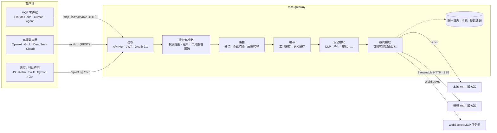

# mcp-gateway

[](https://www.npmjs.com/package/@winstonsayno/mcp-gateway)
[](https://github.com/HarrisonCN/mcp-gateway/actions/workflows/ci.yml)
[](https://github.com/HarrisonCN/mcp-gateway/actions/workflows/codeql.yml)
[](https://securityscorecards.dev/viewer/?uri=github.com/HarrisonCN/mcp-gateway)
[](https://nodejs.org)
[](LICENSE)

[English](README.md) · **简体中文**

**在所有 MCP 服务器前面，只放一个带鉴权、可观测的入口。**

mcp-gateway 位于 AI 客户端（Claude Code、Cursor、自研 Agent、大模型应用、网页与移动端）和它们所用的
[MCP（模型上下文协议）](https://modelcontextprotocol.io)服务器之间。客户端只需连接一次——走 `/mcp` 上的 MCP
Streamable HTTP，或 `/api/v1` 下的 REST API——网关负责识别调用方、判断它能做什么、把调用路由到正确的上游，并记录发生了什么。
密钥、权限范围、限流、策略、日志和指标集中在一处管理，不必在每个客户端里各配一遍。

当前版本：**13.1.2**（npm `latest`）。控制面板在线演示（模拟流量，纯浏览器运行，无需后端）：
<https://harrisoncn.github.io/mcp-gateway/>

## 目录

- [架构](#架构)
- [核心功能](#核心功能)
- [快速开始](#快速开始)
- [最小配置](#最小配置)
- [接入客户端与大模型](#接入客户端与大模型)
- [安全模型](#安全模型)
- [可观测性](#可观测性)
- [版本支持](#版本支持)
- [文档](#文档)
- [参与贡献](#参与贡献)
- [许可证](#许可证)

## 架构



每次调用都会依次经过：鉴权、按调用方权限范围授权、路由（若命中分流规则，会在**查缓存之前**确定目标并完成授权）、
已配置的安全模块，最后在发往上游前针对最终目标再授权一次。功能模块按需加载：只有配置里出现了对应小节，该模块才会被导入。

## 核心功能

**网关核心**
- `/mcp` 端点（Streamable HTTP，支持协议版本 `2025-11-25` 至 `2024-11-05`），聚合所有上游的 tools、resources 和
  prompts，支持进度通知、取消、日志、补全与订阅。
- 上游传输：`stdio`、`streamable-http`、旧版 `sse` 和 `websocket`，可按服务器配置请求头和环境变量。
- `/api/v1` 下的 REST API：工具发现与调用、resources、prompts、请求历史、实时统计（SSE）。
  `GET /api/v1/tools?format=openai|openai-responses|anthropic` 直接返回各家大模型函数调用格式的工具定义。
- 指数退避加随机抖动的自动重连、基于 MCP `ping` 的健康检查、按服务器的并发上限、超时以及工具允许 / 拒绝列表。
- 配置文件变更后热更新服务器、密钥、限流和 CORS（`start --no-watch` 可关闭）。

**访问控制**
- API Key（常量时间比较、可只存 `sha256:` 摘要、支持过期 / 停用）、JWT（HMAC、PEM 或 JWKS；校验 issuer / audience /
  exp），以及符合 MCP 授权规范的 OAuth 2.1 资源服务器。配置有误时一律拒绝启动。
- 按 Key（或 JWT 声明）限定权限范围：服务器与工具通配、独立限流，在 REST 和 `/mcp` 上同样生效；带角色的租户；
  滑动窗口限流；暴力破解锁定。
- 网络防护：IP 白名单、防 DNS 重绑定的 Host / Origin 校验、请求体与参数大小限制、带哈希 CSP 的安全响应头。
  stdio 服务器使用环境变量白名单运行，可选 uid / gid、工作目录和沙箱包装（[stdio 隔离](docs/security/stdio-isolation.md)）。

**运维**
- Prometheus 指标、OpenTelemetry 链路追踪、可选 SQLite 审计日志，日志、历史和 API 输出中的密钥自动脱敏。
- `/dashboard` 控制面板：引导式接入、实时流量、延迟与错误、服务器健康、工具调试台、请求历史。
- 存活 / 就绪探针、已签名的容器镜像、Helm Chart、Kubernetes Operator。
- 命令行：`init`、`validate`、`diff` / `apply`、`gen-key` / `hash-key`、`migrate`、`bench`、`conformance`、`desktop`、
  `policy test`、`plugin`、`pq`、`operator`。
- 可作为库嵌入：`import { Gateway, loadConfig } from '@winstonsayno/mcp-gateway'`。

**扩展模块**——在 `features:` 下按需开启，每个模块在 [`docs/guides`](docs/guides) 中都有说明，例如：
[Cedar / OPA 策略](docs/guides/policy-engine.md)、[DLP](docs/guides/dlp.md)、
[提示注入净化](docs/guides/sanitize.md)、[审批流](docs/guides/approval-flows.md)、
[语义缓存](docs/guides/semantic-cache.md)、[灰度发布](docs/guides/rollouts.md)与[蓝绿部署](docs/guides/blue-green.md)、
[时间回溯重放](docs/guides/time-travel.md)、[实时预算](docs/guides/realtime-budgets.md)、
[任务图](docs/guides/task-graphs.md)、[OpenAI / A2A 桥接](docs/guides/bridges.md)、
[内核插件 SDK](docs/guides/plugin-sdk.md) 和[多地域](docs/guides/multi-region.md)。这些模块实现精简、有单元测试，
但实际使用远少于核心功能；投入使用前请先在自己的环境中验证。

**实验性功能**——[机密计算 / TEE 证明](docs/guides/confidential.md)、[后量子 TLS](docs/guides/pq-tls.md)、
[边缘自治](docs/guides/edge-autonomy.md)、[隐私计算](docs/guides/privacy.md)和[后量子身份](docs/guides/pq-identity.md)。
启用后，`validate`、启动日志和 `GET /api/v1/security` 都会给出 EXPERIMENTAL 提示；各指南写明了它们**不做**什么。

## 快速开始

需要 Node.js 22 或更高版本。

### npm / npx

```bash
npx @winstonsayno/mcp-gateway init      # 生成 mcp-gateway.yml（仅监听回环地址，含两个 stdio 示例服务器）
npx @winstonsayno/mcp-gateway gen-key   # 输出给客户端用的 Key，以及写进配置的 sha256 摘要
# 把摘要写进 mcp-gateway.yml（见下文“最小配置”），然后：
npx @winstonsayno/mcp-gateway validate --strict   # 校验配置；有安全告警时以退出码 2 结束
npx @winstonsayno/mcp-gateway start
```

也可以全局安装：`npm i -g @winstonsayno/mcp-gateway && mcp-gateway start`。控制面板地址为
`http://localhost:4000/dashboard`。

> 未开启鉴权时，网关**拒绝**在非回环地址上启动。绑定 `0.0.0.0` 前请先配置鉴权；只有在可信网络中，才可以使用
> `start --insecure`（`security.insecure: true`）跳过这一限制。

### Docker（GHCR）

多架构镜像（`linux/amd64`、`linux/arm64`）发布为 `ghcr.io/harrisoncn/mcp-gateway`，标签为 `<版本号>`、
`<主版本>.<次版本>`、`<主版本>` 和 `latest`。镜像以非特权用户 `node` 运行，读取 `/app/mcp-gateway.yml`。

```bash
docker run -d -p 4000:4000 \
  -v "$PWD/mcp-gateway.yml:/app/mcp-gateway.yml:ro" \
  -v mcp-gateway-data:/app/data \
  -e MCP_GATEWAY_HOST=0.0.0.0 \
  -e MCP_GATEWAY_API_KEYS=sha256:<gen-key 输出的摘要> \
  ghcr.io/harrisoncn/mcp-gateway:13
```

`MCP_GATEWAY_API_KEYS`（逗号分隔，明文或 `sha256:<hex>`）无需改配置文件即可开启 API Key 鉴权；`MCP_GATEWAY_HOST`
覆盖 `init` 写入的回环地址 `host`，让映射出去的端口可以访问。stdio 服务器在容器内运行，镜像自带 Node.js / npm；
其他运行时（Python、`uvx` 等）请在派生镜像中安装。带 Prometheus 的 Compose 示例见 [`examples/docker`](examples/docker)。

每个镜像都用 cosign 做了无密钥签名（GitHub OIDC），并附带 SLSA 来源证明和 SBOM。部署前请先验证，并在生产清单中固定它输出的摘要：

```bash
cosign verify ghcr.io/harrisoncn/mcp-gateway:13.1.2 \
  --certificate-identity-regexp '^https://github.com/HarrisonCN/mcp-gateway/.github/workflows/docker.yml@' \
  --certificate-oidc-issuer https://token.actions.githubusercontent.com
```

详见[供应链安全](docs/security/supply-chain.md)。

### Kubernetes（Helm）

Chart 就在本仓库中（未发布到 Chart 仓库），安装时必须提供 API Key：

```bash
git clone https://github.com/HarrisonCN/mcp-gateway.git && cd mcp-gateway
kubectl create secret generic gw-secrets --from-literal=MCP_GATEWAY_API_KEYS=sha256:<gen-key 输出的摘要>
helm install gw ./deploy/helm/mcp-gateway --set existingSecret=gw-secrets
```

网关配置写在 Chart 的 `config:` 值中。Pod 以非 root 用户、只读根文件系统运行；探针使用 `/api/v1/health/live` 和
`/api/v1/health/ready`；HPA、PDB、`ServiceMonitor` 和 Operator（`McpGateway` CRD）默认关闭。详见
[Chart 说明](deploy/helm/mcp-gateway/README.md)和 [Kubernetes 指南](docs/guides/kubernetes.md)。

## 最小配置

`mcp-gateway.yml`——开启鉴权、接入一个 stdio 服务器：

```yaml
version: 11            # 配置 schema 版本（13.x 使用 v11）
host: 127.0.0.1        # 只有开启鉴权时才改成 0.0.0.0
port: 4000

auth:
  strategy: api-key
  apiKeys:
    - sha256:<gen-key 输出的摘要>

security:
  dnsRebindingProtection: true   # 对 /mcp 和 API 校验 Host / Origin
  authLockout: true              # 多次鉴权失败后锁定该 IP

servers:
  - id: filesystem
    name: Filesystem
    transport: stdio
    command: npx
    args: ["-y", "@modelcontextprotocol/server-filesystem", "/tmp"]
```

所有配置项、环境变量覆盖、权限范围和模块配置见[配置参考](docs/configuration.md)；更完整的配置文件见 [`examples/`](examples)。

## 接入客户端与大模型

```bash
# REST
curl -H "Authorization: Bearer $KEY" http://localhost:4000/api/v1/tools
curl -X POST http://localhost:4000/api/v1/tools/call \
  -H "Authorization: Bearer $KEY" -H "Content-Type: application/json" \
  -d '{"tool": "read_text_file", "arguments": {"path": "/tmp/hello.txt"}}'

# Claude Code
claude mcp add --transport http gateway http://localhost:4000/mcp --header "Authorization: Bearer $KEY"
```

```jsonc
// Cursor：~/.cursor/mcp.json
{ "mcpServers": { "gateway": { "url": "http://localhost:4000/mcp", "headers": { "Authorization": "Bearer <key>" } } } }
```

只支持 stdio 的客户端可以用 [`mcp-remote`](https://www.npmjs.com/package/mcp-remote) 桥接：
`npx mcp-remote http://localhost:4000/mcp --header "Authorization: Bearer <key>"`。

**任何支持函数调用的大模型。** 网关本身不调用模型。`GET /api/v1/tools?format=openai`（Chat Completions——OpenAI、
DeepSeek 及其他兼容接口）、`format=openai-responses`（Responses API——OpenAI、xAI Grok）或 `format=anthropic`
（Claude Messages API）会返回调用方可用的工具，以及从模型侧工具名到网关 `{ server, tool }` 的 `mapping`；模型发起的工具调用交给
`POST /api/v1/tools/call` 执行即可。完整示例见 [`examples/llm-tools`](examples/llm-tools)；也可以用
[OpenAI 兼容桥接](docs/guides/bridges.md)让网关在内部跑完整个调用循环。这些都是普通的 HTTP 集成，并非与任何模型厂商的合作。

**网页与应用。** 通过 REST 或客户端库接入——[JS / TypeScript](clients/js)（`@winstonsayno/mcp-gateway-client`）、
[Kotlin / Android](clients/kotlin)、[Swift](clients/swift)、[Python](clients/python)、[Go](clients/go)。切勿把长期有效的
API Key 打包进网页或 App：要么经由你自己的后端转发，要么由后端签发短期、带权限范围的 JWT（`auth.jwt.requireExp`、
`maxTokenAgeSeconds`、`mcp_servers` / `mcp_tools` 声明），并用 `cors.origins` 和 `mcp.allowedOrigins` 限定来源。

## 安全模型

网关执行的工具调用可以读文件、调 API、花钱，请把它当作特权服务对待。**运维人员等同于 root**（可以修改 stdio
服务器运行的命令），给最终用户发放的应是限定范围的 Key 或租户角色。

**改道之后重新授权。** 调用在首次授权后可能被转到另一台服务器——来源包括 `routing` 分流、`rollouts`、`blue-green`、
`self-healing` 以及 `realtime-budgets` 降级。网关会在发往上游前，针对**最终**目标再做一次授权（调用方权限范围、
工具暴露、工具策略、数据驻留和安全守卫模块），随后锁定该目标。被拒绝的改道返回 `-32003`，
`data.decision: "reroute-denied"`。

**模块故障有明确的失效策略。** 每个功能模块都声明了自己的策略：

| 策略 | 模块 | 模块已配置但处于故障状态时 |
|---|---|---|
| `closed` | 安全与执行类：`dlp`、`sanitize`、`agent-identity`、`policy-engine`、`approval-flows`、`confidential`、`privacy`、`anomaly`、`multimodal`；配额类：`console`、`realtime-budgets` | 拒绝其管辖范围内的调用，返回 `-32026`（`data.decision: "module-failed"`）；网关本身继续运行 |
| `open` | 分析与优化类，如 `genai-otel`、`billing`、`sla`、`semantic-cache`、`rollouts` | 跳过该模块的钩子 |
| `degrade` | 如 `offline`、`self-healing`、`blue-green`、`edge-autonomy` | 跳过钩子，结果中带 `_meta["mcp-gateway/degraded"]` 标记 |

失效关闭是**有范围的**：故障模块只拒绝落在它自身配置范围内的调用（例如 `dlp.servers`）；范围无法确定时，拒绝所有工具调用。
安全模块始终为 `closed`；`kernel.failurePolicy` 只能覆盖 `console`、`realtime-budgets` 和 `billing` 的策略。
`GET /api/v1/admin/kernel` 可查看每个模块的状态与策略。

**热更新分阶段进行：Prepare → Validate → Commit。** 新连接、目录和模块先在旁路准备好；重载新增的服务器在提交前保持隐藏
（不出现在列表中、不参与路由、授权器不可见），被删除的服务器也只在提交成功后才断开。配置无效时会被拒绝，当前配置继续提供服务。

**错误码**（`/mcp` 上的 JSON-RPC 错误；REST 返回 `403`，并带相同的 `code`）：

| 错误码 | 含义 |
|---|---|
| `-32003` | 禁止访问：超出调用方权限范围、被策略拒绝，或 `reroute-denied` |
| `-32026` | 负责这次调用的某个 `closed` 模块处于故障状态（`module-failed`） |

**安全默认值与检查。** 未开启鉴权时只能监听回环地址；Helm Chart 要求提供 API Key；stdio 服务器不会继承
`MCP_GATEWAY_*` 环境变量。`mcp-gateway validate --strict` 遇到安全告警即失败，`GET /api/v1/security` 报告运行中的安全状态。
CI 中运行 CodeQL、OpenSSF Scorecard、Trivy、`npm audit` 和属性测试；项目**尚未经过独立第三方安全审计**。详见
[威胁模型](docs/security/threat-model.md)和[部署安全清单](docs/deployment.md#security-checklist)。

**安全公告。** MGW-2026-001 至 MGW-2026-008（改道后重新授权、安全模块失效关闭、按网关隔离模块故障、事务化热更新、
分流感知的缓存键、分阶段热更新、委托调用身份上下文、按签发方区分的客户端 ID）均已在 13.1.2 中修复，适用的修复也已回移到
12.0.3 和 10.9.4——见
[SECURITY.md](SECURITY.md#security-advisories)。发现漏洞请通过
[GitHub 安全公告](https://github.com/HarrisonCN/mcp-gateway/security/advisories/new)私下报告，不要提公开 issue。

## 可观测性

- **指标**——`GET /api/v1/metrics` 返回 JSON 聚合数据（请求数、错误、延迟、各服务器状态）。开启 `monitor.prometheus: true`
  后，`/metrics` 和 `/api/v1/metrics?format=prometheus` 输出 Prometheus 文本格式。指标包括 `mcp_gateway_requests_total`、
  `mcp_gateway_errors_total`、`mcp_gateway_request_duration_seconds`、`mcp_gateway_server_up`、
  `mcp_gateway_authz_denials_total`、`mcp_gateway_reroute_denials_total`、`mcp_gateway_module_failure_denials_total`
  和 `mcp_gateway_degraded_calls_total`。指标默认公开，可用 `auth.protect.metrics` 要求鉴权。
- **审计日志**——`audit.enabled: true` 时，借助内置的 `node:sqlite` 把请求元数据（从不保存参数和结果）写入 SQLite；
  `GET /api/v1/requests` 支持过滤与分页查询，`audit.export` 可转发到 SIEM。被拒绝的改道和因模块故障被拒的调用同样会记录。
- **链路追踪**——每次上游调用生成一个 OpenTelemetry span，无需 SDK 即可通过 OTLP/HTTP 导出（`observability.tracing`），
  支持 W3C `traceparent` 传播。
- **健康检查**——`/api/v1/health/live`、`/api/v1/health/ready`、`/api/v1/health`；实时统计 `/api/v1/stats` 和 SSE 流
  `/api/v1/events` 为控制面板提供数据。

详见配置参考中的 [Observability](docs/configuration.md#observability) 和 [Audit log](docs/configuration.md#audit-log)。

## 版本支持

| 版本线 | 最新版本 | npm dist-tag | 镜像标签 | 状态 |
|---|---|---|---|---|
| 13.x | 13.1.2 | `latest` | `:13`、`:latest` | 当前版本——新功能、缺陷与安全修复 |
| 12.x | 12.0.3 | `v12-0` | `:12` | 已被取代——包含 MGW-2026-001、-005、-007 和 -008 的修复；请升级到 13.x |
| 11.x | 11.2.0 | — | `:11` | 已被取代——请升级到 13.x |
| 10.x（LTS） | 10.9.4 | `v10-lts` | `:10` | 2027-10-31 前提供缺陷与安全修复，之后至 2028-10-31 仅提供安全修复 |
| < 10.0 | — | — | — | 不再支持——请用 `mcp-gateway migrate` 升级 |

```bash
npm i @winstonsayno/mcp-gateway            # 13.x
npm i @winstonsayno/mcp-gateway@v10-lts    # 10.x LTS
```

升级：从 10.x 升级请运行 `npx @winstonsayno/mcp-gateway@13 migrate --write`（配置 schema v10 → v11，见
[迁移到 11.0](docs/guides/migrating-to-v11.md)）；从 11.x / 12.x 升级无需迁移配置，请阅读
[迁移到 12.0](docs/guides/migrating-to-v12.md)和[迁移到 13.0](docs/guides/migrating-to-v13.md)。

项目遵循[语义化版本](https://semver.org/lang/zh-CN/)。同一主版本内，`/api/v1` REST API、`/mcp` 行为、配置 schema、
CLI 命令与参数、包根导出以及 Prometheus 指标名只做向后兼容的改动——见[稳定性与版本策略](docs/api-reference.md#stability-and-versioning)。

## 文档

以下文档目前为英文。

| | |
|---|---|
| [入门指南](docs/guides/getting-started.md) | 一步步搭建第一个网关 |
| [配置参考](docs/configuration.md) | 全部配置项、环境变量覆盖、权限范围、热更新 |
| [API 参考](docs/api-reference.md) | REST `/api/v1`、管理 API、`/mcp`、错误码 |
| [部署指南](docs/deployment.md) | Docker、Kubernetes、反向代理、systemd、安全清单 |
| [功能指南](docs/guides) | 每个模块一篇，另含各版本迁移指南 |
| [安全策略](SECURITY.md) · [威胁模型](docs/security/threat-model.md) | 安全公告、加固建议、信任边界 |
| [更新日志](CHANGELOG.md) | 每个版本的变更 |
| [控制面板](dashboard/README.md) | 内置 Web 界面 |

## 参与贡献

```bash
git clone https://github.com/HarrisonCN/mcp-gateway.git && cd mcp-gateway
npm ci
npm run typecheck && npm test
npm run dev -- start -c examples/basic/mcp-gateway.yml
```

详见 [CONTRIBUTING.md](docs/CONTRIBUTING.md)。涉及用户可见的改动时，请同时更新英文和简体中文两份 README。

## 许可证

[MIT](LICENSE) © 2026 HarrisonCN
