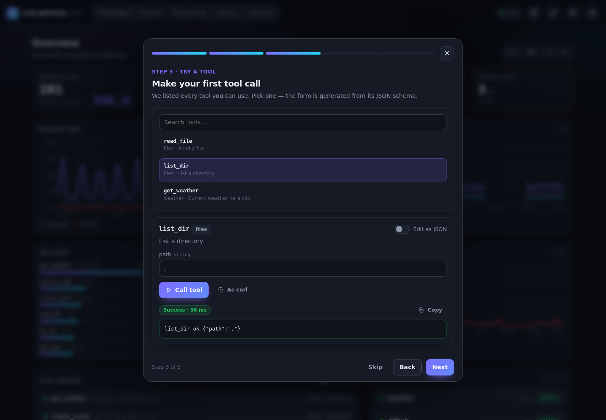
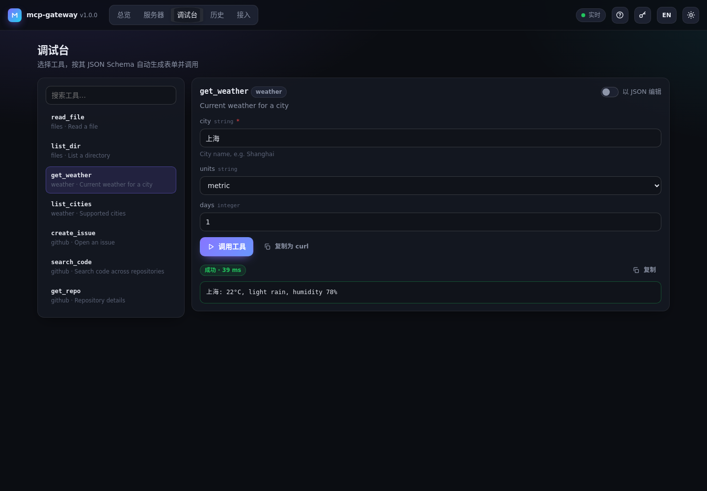
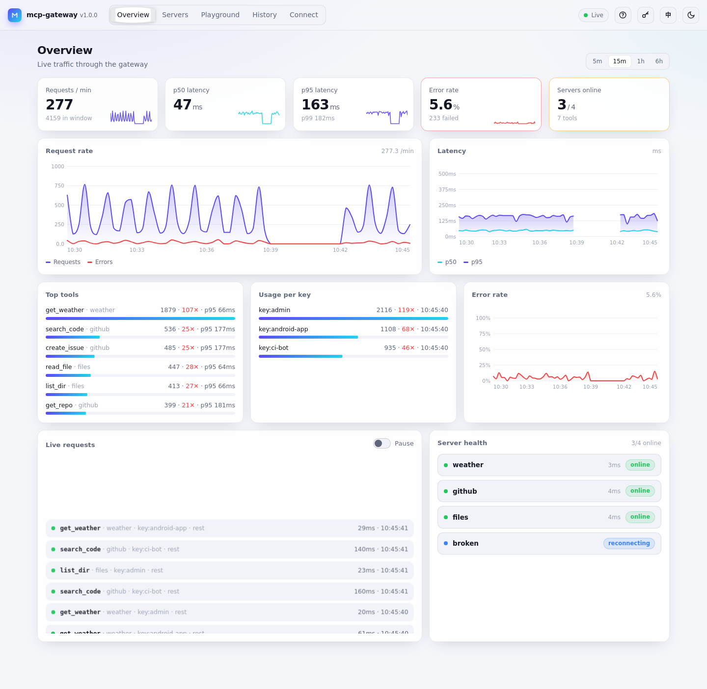
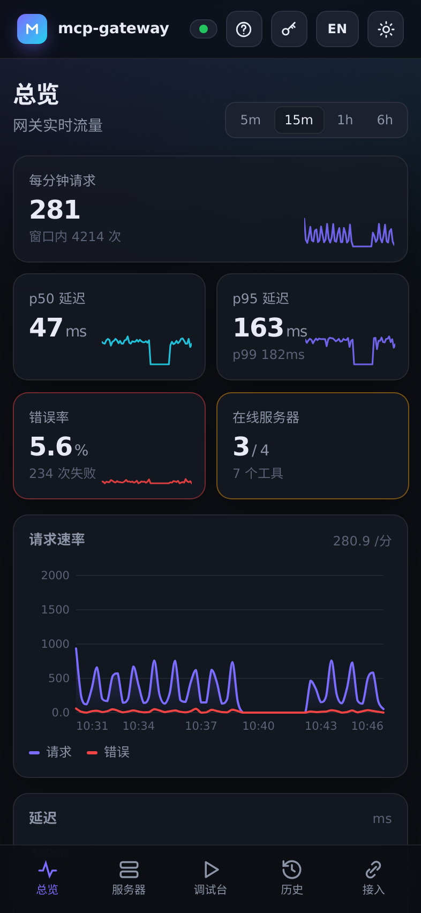

# mcp-gateway Dashboard

A guided, real-time web dashboard for mcp-gateway. It is **one self-contained file** (`index.html`):
no build step, no CDN, no runtime dependencies. Charts are hand-drawn SVG.


## Access

```
http://localhost:4000/dashboard
```

The page itself contains no data. It reads everything from the gateway's own API (`/api/v1/*`), so no extra
backend is needed. Disable it with `dashboard: { enabled: false }`. Add `?guide` to the URL to force the
onboarding guide open.

## Guided onboarding

Shown on the first visit (and whenever a key is required but missing). Dismiss it with **Skip**, **Esc** or ✕;
reopen it any time from the **?** button.

1. **Connect**: paste an API key or JWT and test it (leave empty when auth is off).
2. **Upstream servers**: what is behind the gateway, with status, transport and tool count.
3. **Try a tool**: pick any tool your key may use; a form is generated from its JSON schema (strings, numbers,
   integers, booleans, enums, arrays / objects as JSON, required fields, defaults, descriptions), or switch to
   raw JSON. Call it and see the result.
4. **Connect your client**: copy-paste config for Claude Desktop (through `mcp-remote`), Cursor, Claude Code,
   the TypeScript client (`clients/js`), the Kotlin client (`clients/kotlin`) and curl, all pointing at this
   gateway's `/mcp` URL. Snippets use `<YOUR_API_KEY>` unless you choose to insert your key.

## Pages

| Page | What it shows |
|---|---|
| **Overview** | Requests/min, p50 / p95 / p99 latency, error rate and servers online (with sparklines); request-rate, latency and error-rate charts (5 m – 6 h windows, hover / touch tooltips); top tools; usage per API key; live request stream (pausable); server health |
| **Servers** | One card per upstream server: status, transport, last ping, tools (click to try one), last error and next retry, **Reconnect** |
| **Playground** | The same schema-driven tool runner as the guide, with search and *copy as curl* |
| **History** | `GET /api/v1/requests` with server / tool / client / result / via / kind filters and cursor paging (audit log when enabled) |
| **Connect** | The client snippets from the guide |

## Live data

- `GET /api/v1/events` (Server-Sent Events) pushes every request as it happens plus a health / summary
  snapshot every 2 s. The dashboard reads it with `fetch()` so the API key travels in the `Authorization`
  header (`EventSource` cannot send headers). If the stream is unavailable it polls every 2 s and keeps
  retrying the stream with backoff. The header pill shows **Live**, **Polling** or **Offline**.
- `GET /api/v1/stats?window=…` provides the time series and breakdowns.

See [docs/api-reference.md](../docs/api-reference.md#live-data-dashboard).

## Auth

When auth is enabled, the key is kept in the browser tab (`sessionStorage`) or, with “Remember on this device”,
in `localStorage`, and sent as `Authorization: Bearer …`. Scoped keys only see their own calls and in-scope
servers and tools.

## Accessibility & UX

- English / 中文 toggle (defaults to the browser language), dark / light theme (defaults to the OS setting).
- Responsive down to phone widths, with a bottom tab bar on small screens; safe-area aware.
- Keyboard: arrow keys move between tabs, the guide is a focus-trapped modal, **Esc** closes dialogs,
  visible focus rings, a skip link.
- Respects `prefers-reduced-motion`. Animations only use `transform` / `opacity`; page and theme switches use
  View Transitions where the browser supports them; skeleton loaders while data loads.

## Screenshots

| | |
|---|---|
|  |  |
|  |  |

## Demo build

`demo/mock.js` replaces `fetch` for the gateway API with an in-browser simulation (servers, tools, request stream, SSE events). The GitHub Pages workflow (`.github/workflows/pages.yml`) injects it before the dashboard script and publishes the result to <https://harrisoncn.github.io/mcp-gateway/>. It is not shipped in the npm package or Docker image.
